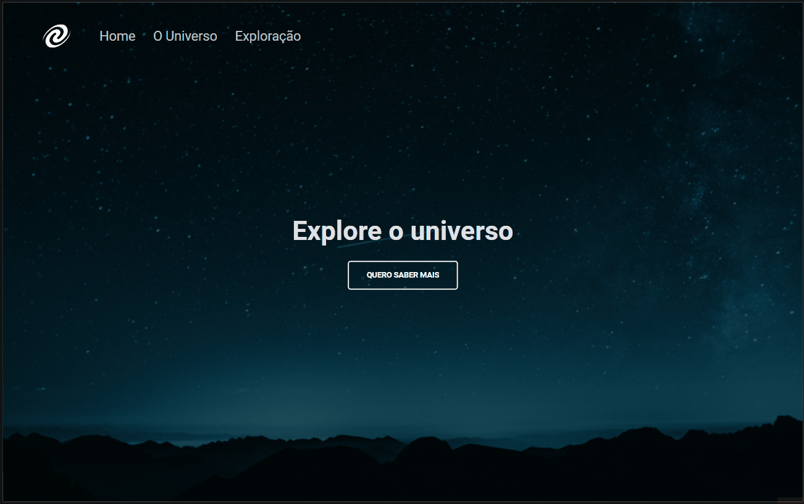
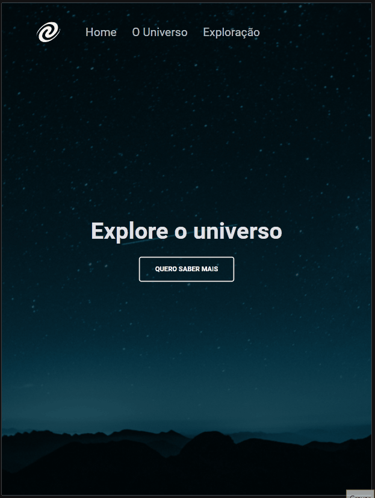
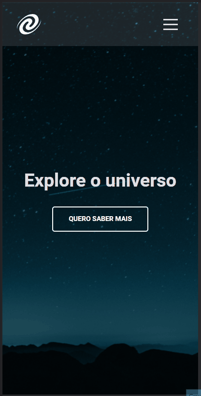

# Explorer_projeto07_SPA_Universe

## SPA - A Single Page Aplication from Universe

<p align="center">
	<a href="#computer-about">About</a> •
 	<a href="#art-layout">Layout</a> • 
 	<a href="#clipboard-how-to-use">How to use</a> • 
 	<a href="#rocket-technologies">Tech Stack</a> • 
 	<a href="#dart-author">Autor</a> • 
 	<a href="#memo-license">License</a>
</p>

### :computer: About

In this challenge, it was requested to create a basic SPA application.  
The page should display 3 diferents pages but changing the default routes from each page link.
It wasen't a requirement, but as a extra mile I added a 404 page not found and implment the responsivity to mobile

I had the oportunity to practice and study:
*	Manipulate DOM with some window elements;
* Build Classes;
* Using fetch() and .then() - as a basic API;
*	Callbacks functions;
*	ES6 Modules.

---

### :art: Layout

### Desktop

<p align="center">
	
</p>

### Tablet and Mobile

<p align="center" style="display: flex; align-items: flex-start; justify-content: center;">
	
	
</p>

---

### :clipboard: How To Use

Just access the link bellow or you can have a better experience using lite-server (node js). 

<a href="https://danpadovani.netlify.app/" target="_blank">SPA Universe</a>

### Pre requirements

Before you begin, you will need to have the following tools installed on your machine:
[Git](https://git-scm.com), [Node.js](https://nodejs.org/en/).

### 🎲 Running the web application (server)

```bash

# Clone this repository
$ git clone https://github.com/Dan-Padovani/Explorer_projeto07_SPA_Universe.git

# Acess the project folder cmd/terminal
$ cd Explorer_projeto07_SPA_Universe.git

# Install the dependencies
$ npm install lite-server

# Run the application 
$ npm start

# The server will start at port:3000 - in your browse acess <http://localhost:3000>
```

---

### :rocket: Technologies


---

### :dart: Author

<p>
	Made with &#128150 by Daniel Padovani &#128075 Entre em contato! 	
</p>
<div>
  <a href="https://www.linkedin.com/in/daniel-padovani/" target="_blank">
    
  </a>  
</div>

---

### :memo: License

This project is under the MIT license. See the [LICENSE](LICENSE) for more information.


